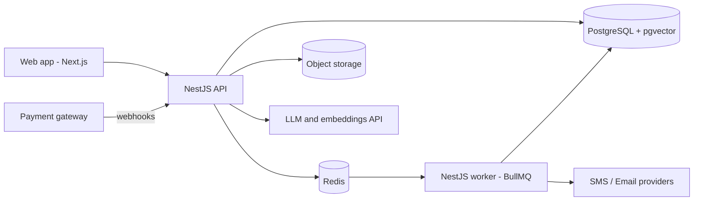
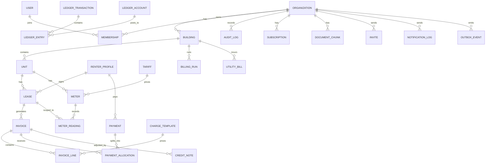

# RentFlow: Multi-Tenant Property Management Platform

**Product Requirements Document (PRD) v1.2**

| | |
|---|---|
| **Author** | Masum Islam Badsha |
| **Status** | Draft, ready for build (v1.2 validates second-AI review; see §19) |
| **Backend** | NestJS (TypeScript), PostgreSQL 16+ with `btree_gist`, `pgcrypto`, `pgvector` |
| **Pilot customer** | A 50-room rental building (the author's own), used as the first real organization on the system |
| **Goal of this project** | Ship a production-grade backend that demonstrates senior-level engineering: data integrity, multi-tenancy, background processing, payments, testing, DevOps and applied AI |
| **Terminology** | `organization` = SaaS customer (building owner company). `renter` = person renting a unit. The word `tenant` alone is deprecated in code/docs except for the SaaS term `multi-tenancy`. Legacy `TEN-*` IDs renamed `REN-*`. Entity `RenterProfile`. Isolation is called `organization isolation` (not "tenant isolation"). |
| **Pilot Cut** | The shippable subset for the real building (alongside day job): RLS + org isolation, REN leases, meters + billing (building calendar), minimal ledger (W4), manual payments + allocation reversals, dues CSV, audit (PII-free). Deferred post-pilot: PLAN-1..3 enforcement, Platform-Admin 2FA hard gate, AI assistant, XLSX, OpenTelemetry. §5, §13 mark `[Pilot Cut]` vs `[Post-pilot]`. |

---

## 1. Summary

RentFlow is a SaaS platform that lets landlords and building managers run a rental property digitally: units, renters, leases, monthly rent, utility bills (electricity, internet, service charges), payments, dues and reminders, all in one system with an auditable financial ledger.

It starts as a tool for one 50-room building and is designed from day one to serve many organizations (multi-tenant SaaS): every tenant-owned row carries `organization_id`, application code always scopes by it, and PostgreSQL Row-Level Security enforces it from R1 onward (see §8.4). A built-in AI assistant ("Ask RentFlow") lets an owner ask questions about their building in plain language.

## 2. Problem

Small and mid-size landlords typically manage rent in notebooks, spreadsheets, and phone calls. This causes:

- **Missed or wrong bills.** Electricity is billed from meter readings and unit rates; internet and service charges are split; mistakes are common.
- **Untracked dues.** Partial payments and carried-forward balances get lost, so nobody is sure who owes what.
- **No history or proof.** Disputes ("I already paid") cannot be settled without a reliable record.
- **Manual chasing.** The owner spends hours each month generating bills and reminding renters.

## 3. Goals, Non-goals and Success Metrics

### Goals
1. Generate all monthly bills for a 50-unit building in under one minute, with no manual arithmetic.
2. Keep an accurate, immutable, auditable record of every charge and payment.
3. Reduce manual follow-up through automated reminders.
4. Support multiple organizations securely on one deployment.
5. Give owners answers about their building in plain language.

### Non-goals (v1)
- Full accounting or tax software
- Renter screening or credit checks
- Native mobile apps (a responsive web app or PWA is enough)
- Property buying or selling workflows

### Success metrics (targets)

| Metric | Target | Measured how |
|---|---|---|
| Monthly bill generation for 50 units | < 60 s wall-clock, fully automatic, on seeded pilot dataset | Timed BullMQ billing-run job in staging |
| Ledger correctness (production) | 0 unbalanced `ledger_transaction`s; 0 invoices where `invoice.total != sum(lines)`; 0 payments where `payment.amount != sum(allocations)+advance_credit` per month (advance excess posts to `ADVANCE_LIABILITY`, not an allocation) | Nightly reconciliation query + CI property tests (fast-check) |
| Duplicate/double-charge incidents (production) | 0 duplicate invoices per `(lease, period)` (lines per charge); 0 double-credited webhooks per month | Partial-unique-constraint violation rate = 0; webhook replay test + prod counter |
| p95 API latency (core endpoints: `GET /invoices`, `GET /renters/:id/statement`, `POST /payments`, `GET /reports/collection` on 50-unit seed, Postgres 16 + Redis local Docker, 50 VUs) | < 300 ms | k6 run in CI (nightly), 5-min sustained |
| Automated test coverage on billing, ledger, payments | ≥ 80% lines+branches | Coverage gate in GitHub Actions |
| Cross-tenant data leakage | 0 (verified by dedicated tests hitting every tenant-scoped endpoint as Org A vs Org B) | `cross-tenant.spec.ts` must pass in CI |
| Pilot adoption | Rent, bills and dues of the pilot building run fully through RentFlow for at least 3 consecutive months; collection rate and hours-saved recorded | Manual log + `reports/collection` export |
| Billing job reliability | ≥ 99% jobs succeed without manual retry per month; DLQ drained < 24h | BullMQ metrics |

## 4. Personas

| Persona | Needs |
|---|---|
| **Owner** (per-organization admin) | Sees collection status, dues, and reports; sets rent and rules; approves adjustments |
| **Manager / Caretaker** (per-organization staff) | Records meter readings and cash payments; handles maintenance requests |
| **Renter** (person occupying a unit; may or may not have a login) | Views bills and history, pays online, downloads receipts, raises maintenance requests |
| **Platform Admin** (RentFlow staff, cross-organization, read-mostly) | Manages organizations, plans and system health (SaaS phase); cannot read renter PII without audit-logged support ticket |

> Identity rule (binding): a `User` (login) belongs to 0..N organizations via `Membership(user_id, organization_id, role)`. A `RenterProfile` (person record) belongs to exactly 1 organization and optionally links to 1 `User` via `renter_profile.user_id`. Roles are per-membership: `OWNER`, `MANAGER`, `RENTER`, plus global `PLATFORM_ADMIN`. A renter portal login is a `User` + `Membership(role=RENTER)` linked to a `RenterProfile`.

## 5. Release Plan

| Release | Theme | Contents | Pilot? |
|---|---|---|---|
| **R1: Core (MVP)** | Replace the notebook — multi-tenant from day one | Auth + Memberships (log-only email fallback until W7), organizations, RLS + `organization_id` + cross-tenant tests (non-superuser role), buildings, units, renter profiles + blind-index HMAC, leases (building calendar, daterange exclusion), minimal ledger postings for invoices (see §13 W4), manual rent invoices (building-period, `date`), manual payments + allocation + reversal of mistaken payment, per-renter dues CSV lite, PII-free append-only audit | [Pilot Cut] |
| **R2: Billing depth** | Replace the calculator | Meters + readings (`read_at`, reason, lease link), tariffs with effective dates, shared charges from `UtilityBill` source, proration on building calendar, late fee (once per invoice, default), full chart of accounts (incl. gateway-clearing, fee-expense, utility payable/expense), collection + dues-aging reports | [Pilot Cut] (PDFs move to R3) |
| **R3: Automation** | Replace the chasing | Scheduled jobs (BullMQ, `org_id` per job), reminders (SMS/email; BTRC assumption to verify, no DLT claim), online payments (`initiated→pending→succeeded/failed/expired`) with store-raw async webhooks, PDF invoices/receipts (async), renter portal POR-1..3 | [Pilot Cut] PDFs + portal minimal; online payments [Post-pilot] unless fake-provider only |
| **R4: Platform** | Make it a product | SaaS plans/limits enforcement (PLAN-1..3), Platform-Admin 2FA hard gate, rate limits, OWASP review, PITR backup/restore runbook (RPO ≤1h), PII anonymize tool (random token + chunk purge) | [Post-pilot] |
| **R5: Intelligence** | Make it stand out | "Ask RentFlow" RAG (pseudonymized tools + injection guard), Bengali and English support | [Post-pilot] (anomaly alerts dropped; never a requirement) |

> Ordering rule: RLS, PII-free audit logging, and idempotency constraints ship in R1. Minimal ledger ships with invoices in W4 (full allocation postings W6). R4 adds *limits/billing of the SaaS itself*, not isolation. Nothing in R2–R5 may assume single-organization data access.
> Pilot rule: ship R1 + R2-minimal to the real building first (W6 target, W8 latest). Do not start R4/R5 before pilot dues CSV + 1 billing cycle are live.

---

## 6. Functional Requirements

Priority: **P0** = must have, **P1** = should have, **P2** = nice to have.

### 6.1 Authentication and Access Control

| ID | Requirement | Priority | Acceptance criteria |
|---|---|---|---|
| AUTH-1 | Email/password signup and login | P0 | Passwords hashed with argon2id; login rate-limited (5/min/IP + 10/min/account); account lockout with backoff; password policy ≥10 chars |
| AUTH-2 | JWT access token (≤15 min) plus rotating refresh token | P0 | Refresh reuse is detected and revokes the session family; logout revokes refresh family server-side |
| AUTH-3 | Membership-scoped RBAC: `OWNER`, `MANAGER`, `RENTER` per organization, plus global `PLATFORM_ADMIN` | P0 | Every endpoint declares required permission; `organization_id` resolved from membership, never from client body; tested per role × per org |
| AUTH-4 | Fine-grained permissions (e.g. Manager can record payments but not edit rent) | P1 | Implemented with CASL or an equivalent policy layer; permission matrix documented in code |
| AUTH-5 | Invite users to an organization by email, incl. renter portal invites | P0 | Invite links expire (≤72h); single use; accepting as RENTER links `User` to existing `RenterProfile` (matched by org + `phone_hmac`/`email_hmac` blind index, never plaintext); never creates a duplicate profile silently; R1 uses log-only email fallback until real delivery lands W7 |
| AUTH-6 | Password reset and email verification | P0 | Tokens time-limited (≤1h reset, ≤24h verify), single use, enumeration-safe; R1 works with log-only delivery in dev/pilot |
| AUTH-7 | Optional 2FA (TOTP) for owners | P2 | Recovery codes hashed at rest; [Post-pilot] hard-gate candidate |
| AUTH-8 | Multi-organization switching | P1 | `GET /me/memberships` lists orgs; access token carries single `org_id` claim; switching re-issues token, logged |
| AUTH-9 | Platform Admin guardrails | P1 | Demoted P0→P1 (was blocked on P2 AUTH-7): cross-org reads via exempt `support_read` role (not migration service role) + ticket reference, audit-logged, no bulk PII export; 2FA hard gate lands in R4 |

### 6.2 Organizations, Buildings and Units

| ID | Requirement | Priority | Acceptance criteria |
|---|---|---|---|
| ORG-1 | An organization owns multiple buildings | P0 | All data scoped to an organization via `organization_id`; RLS policy on every tenant table; missing scope = denied |
| ORG-2 | Buildings contain floors and units (rooms/flats) | P0 | Unit has number, floor, type, base rent, status (`vacant`, `occupied`, `maintenance`); status derived from active lease + manual maintenance flag, not free text |
| ORG-3 | Bulk import of units from CSV | P1 | Validation report for bad rows; import is atomic (single transaction, rollback on error) |
| ORG-4 | Unit archive instead of hard delete | P1 | Historical invoices remain intact; archived units excluded from billing runs |
| ORG-5 | Organization membership list and role management | P0 | Owner can add/remove/change role; last-owner protection; all changes audit-logged |
| PLAN-1 | SaaS plans with limits (units, users, SMS/month, storage, AI queries/day) | P1 | `Plan` + `Subscription(organization_id, plan_id, status)` tables; enforcement at service layer returns `402/403 + upgrade_code`; free/pilot plan seeded |
| PLAN-2 | Usage metering per organization | P1 | Counters for billable actions (SMS sent, AI queries, active units); visible at `GET /organizations/:id/usage` |
| PLAN-3 | Plan downgrade/upgrade guard | P1 | Downgrade blocked if usage exceeds target plan limits; explicit error listing blockers |

### 6.3 Renters and Leases

| ID | Requirement | Priority | Acceptance criteria |
|---|---|---|---|
| REN-1 | Renter profiles with contact details and emergency contact [Pilot Cut] | P0 | Phone normalized to E.164 (`+880...`); uniqueness + invite matching via blind index `phone_hmac`/`email_hmac` = HMAC-SHA256(normalized, dedicated key ≠ encryption key); PII columns AES-256-GCM; one profile per person per org enforced on HMAC |
| REN-2 | Lease with start/end date (nullable end = open-ended), monthly rent, security deposit; building billing calendar | P0 | Periods are calendar `date` ranges on the **building** (`billing_period = [period_start, period_end)` as `date`, Asia/Dhaka); mid-period move-in/out prorated daily; per-lease `billing_anchor_day` removed (was contradicting building runs; due-day anchoring only, see BILL-9). No overlapping active leases via `lease_period daterange` + partial exclusion `EXCLUDE USING gist (unit_id WITH =, lease_period WITH &&) WHERE (status IN ('active','draft'))` — requires `CREATE EXTENSION btree_gist`; app also checks; `predecessor_lease_id` versioning (ex REN-6 merged) |
| REN-3 | Rent escalation rule (e.g. fixed % per year) | P1 | Stored on lease (`escalation_pct`, `escalation_every_months`); applied on renewal via new lease version, never by mutating issued invoices |
| REN-4 | Move-out workflow: final meter reading, dues settlement, deposit adjustment [Pilot Cut] | P1 | Final reading uses `reason=move_out` tied to lease (see BILL-3, allows same-period double read); produces final statement; deposit via ledger transfer, refund as reversal; `status → closed`, `lease_period` upper-bounded |
| REN-5 | Document upload (ID copy, agreement) + unstructured lease clauses | P1 | Object storage (≤10 MB/file, pdf/jpg/png allowlist; virus-scan hook); signed URLs ≤15 min; PII encrypted; agreement text extracted for AI (see AI-2 prompt-injection guard); deleted/purged on anonymization (embeddings too) |

### 6.4 Billing Engine

| ID | Requirement | Priority | Acceptance criteria |
|---|---|---|---|
| BILL-1 | Recurring charge templates: rent, service charge, gas, internet share, custom [Pilot Cut] | P0 | Templates per org → building with per-unit overrides; `charge_code` + `ledger_account` mapping; `due_days` (default 7) + `grace_days` (default 3) on template with building-default fallback; `due_date = period_end + due_days` (Asia/Dhaka calendar `date`); drives FIFO, aging, late fee, reminders |
| BILL-2 | Monthly invoice generation by idempotent billing run (building calendar) [Pilot Cut] | P0 | `BillingRun(building_id, period_start DATE, period_end DATE, status)`; one calendar per building; re-run reuses run; invoice unique `UNIQUE (lease_id, billing_period_start) WHERE status <> 'void'`; replacement links `supersedes_invoice_id`; line unique `(invoice_id, charge_code)` (one invoice with many lines — lines table is authoritative); per-lease retry without duplicating successes |
| BILL-3 | Electricity billing from meter readings [Pilot Cut] | P0 | `Meter(unit_id, meter_type, serial)` + `Tariff(meter_type, slabs JSONB, demand_charge, effective_from/to)` — slabs evaluated per sub-meter reading (documented); `MeterReading(meter_id, read_at TIMESTAMPTZ, period_start DATE, reading, reason: regular\|move_in\|move_out\|replacement, lease_id NULLABLE, status)`; unique `(meter_id, read_at)` + check one `regular` per `(meter, period)` (allows move_out + regular same period); rejects current < previous unless `is_reset=true` + OWNER evidence; missing → `estimated` line + next-month true-up |
| BILL-4 | Shared bills split across units | P1 | Source is `UtilityBill(building_id, utility, period, total_cost, due_date)` (required input even though margin report REP-4 is P2); rules `equal` (pilot) then `per_occupant`/`fixed_weight`; poisha remainder to lowest `unit_number`; splits sum = source; shared-meter loss posts to `UTILITY_EXPENSE` with rule documented per building |
| BILL-5 | Late fee rules (fixed or percentage after grace days) | P1 | **Default: once per invoice, non-compounding, never on prior fees.** Optional recurring-monthly mode behind explicit building flag with cap (`max_late_fee_per_invoice`); formula + `grace_days` on template/building; computed from `due_date` (BILL-1) |
| BILL-6 | Invoice lifecycle with explicit state machine [Pilot Cut] | P0 | Stored states: `draft, issued, partially_paid, paid, void`. `overdue` is a **computed flag** (`status IN (issued,partially_paid) AND today > due_date`), never stored. Transitions (actor): `draft→issued` (OWNER/MANAGER), `draft→deleted` (drafts have no ledger; OWNER), `issued→partially_paid→paid`, `issued→paid` (full pay allowed direct), `issued/partially_paid→void` (OWNER + reason, reversal + compensating allocations; credit balance → `ADVANCE_LIABILITY`); voided keeps VOID PDF; replacement via `supersedes_invoice_id` allowed by BILL-2 partial index |
| BILL-7 | Invoice and receipt PDFs | P1 | Moved to R3; Noto Sans Bengali spike W1; async job; amounts BIGINT poisha, BDT-only for pilot (`currency='BDT'` display; multi-currency deferred) |
| BILL-8 | Manual adjustments and credit notes with reason | P1 | OWNER only; `CreditNote(invoice_id, ...)` + ledger contra-revenue; audit-logged; never negative-line edit |
| BILL-9 | Proration, vacancy, billing calendar [Pilot Cut] | P0 | Single building calendar (`date` range, Asia/Dhaka); prorate `rent × days_occupied/days_in_period`; `vacant` → no rent but configured carry charges to owner account |

### 6.5 Ledger, Payments and Dues

| ID | Requirement | Priority | Acceptance criteria |
|---|---|---|---|
| LED-1 | Double-entry ledger with fixed chart of accounts; minimal postings in W4 [Pilot Cut] | P0 | Seeded per org: `AR_RENTER`, `RENT/ELECTRICITY/SERVICE/LATE_FEE_REVENUE`, `CASH/BANK/MOBILE_WALLET`, `GATEWAY_CLEARING` (gateway receivable), `GATEWAY_FEE_EXPENSE`, `UTILITY_PAYABLE`, `UTILITY_EXPENSE`, `ADVANCE_LIABILITY`, `DEPOSIT_LIABILITY`, `CREDIT_CONTRA_REVENUE`. Invoice = `Dr AR / Cr REVENUE`; manual pay = `Dr CASH/BANK / Cr AR`; advance = `Cr ADVANCE_LIABILITY`; gateway success = `Dr GATEWAY_CLEARING / Cr AR`, settlement = `Dr BANK / Cr GATEWAY_CLEARING` + `Dr FEE_EXPENSE`; utility source = `Dr UTILITY_EXPENSE / Cr UTILITY_PAYABLE` so REP-4 stays in-ledger (single truth). Balanced per transaction (deferred trigger + fast-check). W4 ships invoice postings; W6 adds allocation/payment postings (no backfill cliff) |
| LED-2 | Ledger entries are immutable | P0 | `REVOKE UPDATE/DELETE` + trigger; reversals via `reverses_transaction_id` |
| LED-3 | Per-renter balance and dues aging (0–30, 31–60, 61+ days, by `due_date` per BILL-1) | P0 | Ledger is single truth; `invoice.total` cached display, nightly reconcile → alert |
| PAY-1 | Record manual payments + reverse mistakes [Pilot Cut] | P0 | `Payment(organization_id, renter_id FK, lease_id NULLABLE, method, amount_poisha BIGINT, idempotency_key, status, provider_event_id NULLABLE)`; partial/multi/advance supported; overpay → `ADVANCE_LIABILITY`; **mistaken manual payment reversed via `reverses_payment_id` + compensating ledger entries** (most common error); `renter_id` required so advances tie to a person |
| PAY-2 | Allocation oldest-due-first (per org config) [Pilot Cut] | P0 | FIFO by `due_date`; explicit `allocation` rows; `FOR UPDATE` locking; unapply/void = compensating rows |
| PAY-3 | Online payment via gateway | P1 | [Post-pilot] beyond fake-provider: states `initiated→pending→succeeded/failed/expired`; payment-link token embeds `org_id` for webhook resolution; amounts BIGINT poisha |
| PAY-4 | Async webhook handling | P1 | No per-IP throttle on signed webhooks (burst-safe); store raw `provider_event` → return 200 immediately → queue processes (no ≤10s sync target); signature first, unique `(org, provider, provider_event_id)` |
| PAY-5 | Reconciliation job | P1 | Nightly gateway-clearing vs ledger; `GET /reports/reconciliation` + alert |
| PAY-6 | Refunds, deposit returns, payment reversals | P1 | Reversals against original; deposit needs REN-4 final statement + OWNER |

### 6.6 Notifications

| ID | Requirement | Priority | Acceptance criteria |
|---|---|---|---|
| NOT-1 | Templates in Bengali and English with variables | P1 | Renter `locale` (`bn`/`en`) stored on RenterProfile, default `bn`; fallback to English if template missing |
| NOT-2 | Channels: email (P1), SMS (P1), in-app (P2) | P1 | Adapter + fake default; sender config per org per **BTRC masking/non-masking rules (assumption to verify — do not assume India's DLT)** (see Open Q2) |
| NOT-3 | Scheduled reminders: bill issued, due soon (T-3d), overdue (T+1, +7) | P1 | Schedule configurable per organization; quiet hours 21:00–08:00 Asia/Dhaka; no duplicate send per `(invoice, reminder_type)` (unique constraint) |
| NOT-4 | Delivery tracking with retries and exponential backoff | P1 | `NotificationLog` with status; 5 retries w/ backoff; DLQ view at `GET /notifications/failures`; plan SMS quota enforced before send |
| NOT-5 | Renter notification preferences and opt-out | P1 | Opt-out for nudges; `bill_issued` + `overdue` treated as transactional (assumed non-opt-outable — verify local rule); labeled as such |

### 6.7 Maintenance Requests

| ID | Requirement | Priority | Acceptance criteria |
|---|---|---|---|
| MNT-1 | Renters create requests with description and photos | P2 | Status machine: `open → in_progress → resolved → closed`; `resolved → in_progress` (reopen ≤7d) allowed; all transitions timestamped + actor-stamped |
| MNT-2 | Manager assigns and comments | P2 | Renter notified on status change (respects NOT-5 except safety issues which always notify) |

### 6.8 Reports and Analytics

| ID | Requirement | Priority | Acceptance criteria |
|---|---|---|---|
| REP-1 | Monthly collection report: billed vs collected | P0 | Filter by building and period; read from ledger (CQRS-lite view), paginated, cacheable 5 min |
| REP-2 | Dues aging report | P0 | Exportable to CSV/XLSX (streamed, ≤100k rows); ships in R1 as minimal CSV, full aging in R2 |
| REP-3 | Occupancy and vacancy report | P1 | Historical trend (month-end snapshots) |
| REP-4 | Utility cost recovered vs actual utility cost | P2 | Shows margin or loss per utility; requires source-bill input (`UtilityBill` entity) |
| REP-5 | Reconciliation exceptions report | P1 | Gateway vs ledger mismatches (see PAY-5) |

### 6.9 Audit Log

| ID | Requirement | Priority | Acceptance criteria |
|---|---|---|---|
| AUD-1 | PII-free audit of financial/permission changes [Pilot Cut] | P0 | Append-only (no UPDATE/DELETE); stores `organization_id`, actor, entity IDs, **non-PII field diffs only (no names/phones/emails/ID numbers in JSONB)**; request ID + IP; covers void, adjustment, payment + reversal, refund, role change, admin reads. PII stays in encrypted profile tables; anonymization never needs to rewrite audit |

### 6.10 "Ask RentFlow" AI Assistant (RAG)

| ID | Requirement | Priority | Acceptance criteria |
|---|---|---|---|
| AI-1 | Owners ask natural-language questions ("Who has not paid this month?", "What does Room 12's lease say about pets?") [Post-pilot] | P1 | Tools return **pseudonymized renter IDs**; names revealed only with explicit org consent for LLM processing (logged); citations (invoice/doc IDs); "not found" fallback; pets Q uses REN-5 clause text |
| AI-2 | Retrieval over lease documents and building rules (pgvector) [Post-pilot] | P1 | `DocumentChunk(org, ...)` RLS + mandatory org filter + model version; **indirect prompt-injection guard**: extracted text treated as untrusted, instruction-allowlist, no tool auto-execution from doc content; chunks deleted on anonymization |
| AI-3 | Structured questions via whitelisted read-only tools [Post-pilot] | P1 | Only `getDuesAging`, `getInvoice`, `getLeaseSummary`; logged; no SQL |
| AI-4 | Draft reminders (human approves) | P2 | [Post-pilot]; NOT-5 check on approval |
| AI-5 | Evaluation set (nightly regression, not resume accuracy %) | P2 | ≥20 EN+BN starter set, grow to ≥50 before quoting accuracy; nightly run tracks regressions only |
| AI-6 | Cost/abuse guardrails [Post-pilot] | P1 | Daily quota (PLAN-1), token cap, adapter; no raw PII in prompts without consent |

---

## 7. Non-Functional Requirements

| Area | Requirement |
|---|---|
| **Security** | OWASP Top 10 pre-release; Helmet, CORS allow-list; rate limits: auth 5/min/IP, default API 120/min/user; **webhooks: no per-IP throttle on signed events** (burst-safe; idempotency handles replay); DTO whitelist; secrets via env/manager; PII AES-256-GCM + HMAC blind index (separate keys); signed URLs ≤15 min; file caps; `npm audit` gate |
| **Multi-tenancy** | App scope (AsyncLocalStorage, mandatory) **and** RLS from R1 (W2); `SET LOCAL app.current_org` per transaction; **patterns**: login/membership bootstrap = auth-context (no org), webhooks resolve org from payment-link token → set context, BullMQ/cron jobs carry `org_id` → set per job, admin cross-org via exempt `support_read` role (migration service role never used at runtime); `FORCE RLS`; app + tests connect as non-superuser (superuser bypasses RLS); cross-tenant suite blocks merge |
| **Performance** | Runs chunked ≤50 leases/job; cursor pagination (20/100); indexes `(org, ...)`, `(lease_id, billing_period_start)`, `(due_date)`; reports cached 5 min; PDFs async |
| **Reliability** | Graceful shutdown; `/health` + `/ready` (DB+Redis); 5× backoff + DLQ; **managed Postgres with PITR (RPO ≤1h, RTO ≤4h)** — daily snapshots alone lose a day of cash; restore drilled monthly |
| **Observability** | Pino JSON + request IDs; Sentry; metrics (rate/latency/queue/failed/webhook-lag/SMS); [Post-pilot] OpenTelemetry traces for billing flow |
| **Data integrity** | Money **`BIGINT` poisha only**, never float/numeric; BDT-only pilot (`currency='BDT'`); constraints back invariants; nightly reconcile |
| **Localization** | BDT-only schema for pilot (multi-currency deferred); bn+en messages; `Asia/Dhaka` calendar `date` canonical; bn numerals display-only |
| **Compliance and privacy** | Min data; retention **assumption to verify (Q5): 7y financial retention assumed, not legal advice**; anonymize on request (`name→REDACTED`, PII → random token, HMAC rotated, docs + `document_chunks` deleted) while ledger/PII-free audit/totals preserved; CSV export; SMS consent logged |
| **Maintainability** | Modular monolith + import lint; **ADR-001 ORM choice in W1** (Prisma vs TypeORM: decides `SET LOCAL`, exclusion, deferred triggers); ADRs for monolith, RLS, outbox, ledger, AI |

---

## 8. System Architecture

### 8.1 Style

A **modular monolith**: one deployable NestJS application with strictly separated modules that communicate through public services and domain events. This is the right size for one developer, and any module can later be extracted into a service if needed. Explaining that trade-off is part of the resume value.

### 8.2 High-level diagram



### 8.3 NestJS modules

`AuthModule`, `UsersModule`, `MembershipsModule`, `OrganizationsModule`, `SubscriptionsModule` [Post-pilot], `PropertiesModule`, `RentersModule`, `LeasesModule`, `BillingModule` (runs, invoices/lines, templates, tariffs, utility source bills), `MetersModule`, `LedgerModule` (W4-minimal), `PaymentsModule` (incl. reversals, async webhooks, reconciliation), `NotificationsModule`, `MaintenanceModule`, `ReportsModule`, `AuditModule`, `AssistantModule` [Post-pilot], `FilesModule`, `HealthModule`, `PortalModule` (POR-1..3, R3-minimal), plus shared `CommonModule`.

### 8.4 Multi-tenancy design

- **Model:** shared DB/schema; every org-owned table (`memberships`, `renter_profiles`, `leases`, `meters`, `meter_readings`, `tariffs`, `billing_runs`, `invoices`, `invoice_lines`, `payments`, `allocations`, `ledger_*`, `audit_log`, `document_chunks`, `notification_log`, `outbox`) has `organization_id`. `users` is global (multi-org via `memberships`); `plans/subscriptions` global + per-org.
- **Enforcement (application):** single active org via AsyncLocalStorage (`scopedQuery()` required); bootstrap (login/`/me/memberships`) uses auth-context; webhooks resolve org from payment-link token; jobs carry `org_id`; admin cross-org via `support_read` + `org_id` + ticket (never migration role).
- **Enforcement (database):** RLS + `FORCE RLS` from R1; `SET LOCAL app.current_org` per txn (ADR-001 covers Prisma/pgbouncer); `btree_gist` for exclusion; app + tests use non-superuser role (superusers bypass RLS); migrations-only service role.
- **Verification:** `cross-tenant.spec.ts` (W2, CI gate) enumerates tenant-scoped routes from OpenAPI — any route without an Org-A-vs-B read+write case fails the build.

### 8.5 Key patterns

| Pattern | Where it is used |
|---|---|
| **Transactional outbox** | Domain events (e.g. `InvoiceIssued`) are written in the same transaction as the change, then published to the queue, so no notification is lost or sent for a rolled-back change |
| **Idempotency keys** | Payment recording, webhook handling, bill generation |
| **Double-entry ledger** | All money movement |
| **CQRS-lite** | Report queries use dedicated read queries or materialized views, separate from write models |
| **Strategy / adapter** | Payment gateways, SMS and email providers, LLM provider |
| **Guards + policies** | Authentication, RBAC, per-resource authorization |

### 8.6 Technology stack

| Layer | Choice | Reason |
|---|---|---|
| Framework | NestJS (TypeScript) | The project's target skill |
| Database | PostgreSQL 16+ | Relational integrity, constraints, RLS, pgvector |
| ORM / migrations | ADR-001 in W1 picks Prisma or TypeORM; SQL migrations for RLS/exclusion/triggers | Type safety plus raw SQL where needed |
| Queue and cache | Redis with BullMQ | Scheduled and retryable jobs, caching |
| Scheduling | `@nestjs/schedule` to enqueue; BullMQ to execute | Cron triggers, durable execution |
| Validation | `class-validator` / `class-transformer` (or Zod) | DTO validation |
| Auth | Passport JWT, argon2, CASL | Sessions and permissions |
| Docs | Swagger/OpenAPI | Live API documentation |
| Files | S3-compatible storage (Cloudflare R2, AWS S3, or MinIO locally) | Documents and PDFs |
| PDF | Puppeteer or PDFKit with Bengali-capable font | Invoices and receipts |
| Observability | Pino logs, Sentry, OpenTelemetry; Prometheus/Grafana optional | Debugging in production |
| AI | Embeddings + LLM API, pgvector, tool calling | RAG assistant |
| Frontend | Next.js + TypeScript | Existing strength; keep it thin, the backend is the star |
| DevOps | Docker, docker-compose, GitHub Actions | Reproducible builds and CI/CD |

---

## 9. Data Model (core entities)



**Important rules encoded in the database**
- Extensions: `btree_gist` (exclusion on `unit_id`), `pgcrypto`, `pgvector`.
- `LEASE`: `lease_period daterange` + partial exclusion `EXCLUDE USING gist (unit_id WITH =, lease_period WITH &&) WHERE (status IN ('active','draft'))`.
- `INVOICE`: `billing_period_start/end DATE` (Asia/Dhaka calendar); partial unique `(lease_id, billing_period_start) WHERE status <> 'void'`; `supersedes_invoice_id FK NULLABLE`; `total_poisha BIGINT CHECK >= 0`, `currency='BDT'`; `due_date DATE NOT NULL` (from BILL-1).
- `INVOICE_LINE`: unique `(invoice_id, charge_code)`; `amount_poisha BIGINT`.
- `PAYMENT`: `renter_id NOT NULL FK`, `amount_poisha BIGINT`, unique `(organization_id, idempotency_key)`, unique `(organization_id, provider, provider_event_id)` where not null, `status CHECK IN ('initiated','pending','succeeded','failed','expired','reversed')`, `reverses_payment_id FK NULLABLE`.
- `LEDGER_ENTRY`: `REVOKE UPDATE, DELETE` + trigger; deferred balance trigger per transaction.
- `METER`: unique (`unit_id`, `meter_type`, `serial`); `METER_READING`: unique (`meter_id`, `read_at`), one `regular` per `(meter_id, period_start)` (allows `move_out` + `regular` same period); `lease_id` nullable FK.
- `RENTER_PROFILE`: `phone_hmac`/`email_hmac` unique per org; PII ciphertext columns separate.
- `NOTIFICATION_LOG`: unique (`invoice_id`, `reminder_type`) where invoice-linked.
- Money: `BIGINT` poisha everywhere; no `numeric`/float.

---

## 10. API Surface (illustrative)

All routes versioned (`/api/v1`), org-scoped via membership (active org from token; `support_read` admin passes `?orgId=` + ticket), cursor-paginated, enveloped errors, Swagger-documented. Cross-tenant suite auto-enumerates this surface — untested routes fail CI.

```
POST   /auth/register            POST   /auth/login
POST   /auth/refresh             POST   /auth/logout
GET    /me/memberships           POST   /me/switch-organization

GET    /buildings                POST   /buildings
GET    /buildings/:id/units      POST   /units
GET    /renters                  POST   /renters
GET    /renters/:id/statement
POST   /invites                  POST   /invites/:id/accept
POST   /leases                   POST   /leases/:id/terminate
POST   /leases/:id/renew         GET    /leases?unitId=&status=

POST   /meters                   POST   /tariffs
POST   /meter-readings           (body: meterId, readAt, reading, reason, leaseId?)
GET    /meter-readings?meterId=&from=&to=
POST   /utility-bills            GET    /utility-bills?buildingId=&period=
POST   /billing/runs             (Idempotency-Key; body: buildingId, periodStart DATE, periodEnd DATE)
GET    /billing/runs/:id         POST   /billing/runs/:id/retry-failed
GET    /invoices                 GET    /invoices/:id/pdf
POST   /invoices/:id/void        (OWNER, reason; credit → ADVANCE_LIABILITY)
POST   /credit-notes             GET    /credit-notes?invoiceId=

POST   /payments                 (Idempotency-Key required; body: renterId)
POST   /payments/:id/reverse     (correct mistaken payment; OWNER)
POST   /webhooks/:provider       (stores raw → 200 → queue; no IP throttle)
GET    /reports/collection       GET    /reports/dues-aging
GET    /reports/reconciliation   GET    /organizations/:id/usage
POST   /portal/login             GET    /portal/bills
POST   /portal/maintenance       (POR-1..3 renter portal minimal, R3)
POST   /assistant/ask            (quota-checked) [Post-pilot]
GET    /notifications/failures
```

### 6.11 Renter portal (R3-minimal)

| ID | Requirement | Priority | Acceptance criteria |
|---|---|---|---|
| POR-1 | Renter login linked to profile | P0 | AUTH-5 invite → `RENTER` membership + `renter_profile.user_id`; sees only own leases/invoices |
| POR-2 | View bills, statements, receipts | P0 | `GET /portal/bills`, statement, PDF download |
| POR-3 | Pay online + raise maintenance | P1 | Payment-link flow (PAY-3 states); MNT-1 with photos |

---

## 11. The "Next Level" Engineering Challenges

This section is what separates RentFlow from a standard CRUD project.

| Challenge | Approach | What it proves |
|---|---|---|
| Money correctness | Double-entry ledger (W4-minimal), immutable entries, BIGINT poisha, reversal-only corrections | You understand financial data integrity |
| Duplicate-safe billing | Partial unique indexes, idempotent runs, per-lease retry | You design for retries and failures |
| Payment webhooks | Store-raw + async, signature verification, idempotency keys, replay tests, gateway-clearing reconciliation | You handle unreliable external systems |
| Organization isolation | App scoping + RLS + non-superuser cross-tenant tests with route discovery | You can build secure SaaS |
| Background processing | BullMQ queues, retries, backoff, dead-letter handling, job dashboards | You can build asynchronous systems |
| Reliable events | Transactional outbox | You know the dual-write problem and how to solve it |
| Concurrency | Row locking or optimistic locking on payment allocation and meter readings | You reason about race conditions |
| Query performance | Indexing strategy, `EXPLAIN ANALYZE`, materialized views for reports | You can diagnose slow queries |
| RAG assistant | Chunking, embeddings, pgvector, tenant-scoped retrieval, tool calling, citations, evaluation set | You can ship practical AI features safely |
| Quality | Unit, integration (Testcontainers), e2e (Supertest), load tests (k6) | You deliver tested software |
| Delivery | Docker, CI/CD, migrations in pipeline, health checks, monitoring | You can run software in production |

---

## 12. Testing and Quality Strategy

| Level | Tooling | Focus |
|---|---|---|
| Unit | Jest | Billing calculations, tariff slabs, split rounding, allocation logic |
| Property-based | fast-check | Ledger always balances; allocations never exceed payment amount |
| Integration | Jest + Testcontainers (real PG + Redis, **non-superuser app role** — superuser bypasses RLS) | Repositories, constraints, RLS, queues |
| End-to-end | Supertest | Full flows: lease, meter reading (incl. move_out same period), invoice, payment + reversal, dues |
| Security | Cross-tenant suite with OpenAPI route discovery + dependency audit | Untested route fails CI; no leakage; no vuln packages |
| Load | k6 | Bill generation for 500+ units; p95 latency |
| AI evaluation | Fixed question set with expected answers | Catch retrieval and prompt regressions |
| CI gates | GitHub Actions | Lint, type-check, tests, coverage threshold, build, container scan |

---

## 13. Delivery Roadmap (about 12 weeks part-time; realistic ~16 — Pilot Cut first)

| Weeks | Milestone | Deliverables | Cut line if behind |
|---|---|---|---|
| 1 | Foundation | Repo, NestJS, Compose (PG16+`btree_gist`+pgvector, Redis), CI, Pino, Swagger, Bengali font spike, **ADR-001 ORM** | Drop Grafana (keep Sentry+Pino) |
| 2 | Auth + tenancy (RLS now) [Pilot Cut] | Register/login/refresh + revocation, Memberships + HMAC blind index, RLS + `FORCE RLS` + non-superuser role, `cross-tenant.spec.ts` with route discovery (must pass), PII-free audit scaffold | Log-only email; AUTH-7/9 2FA → R4 |
| 3 | Property core [Pilot Cut] | Buildings, units, REN-1 profiles + invites, REN-2 leases (daterange + `btree_gist`, building calendar) | CSV import → R4 |
| 4 | Billing v1 + ledger-min [Pilot Cut] | Templates with `due_days/grace_days`, building-period `BillingRun` (partial unique + `supersedes`), invoice states + computed overdue, proration/vacancy, **minimal ledger (invoice postings)**, dues CSV lite | — (no defer; pilot foundation) |
| 5 | Utilities [Pilot Cut] | Meters + `read_at`/reason/lease link, tariffs with dates (per-sub-meter), equal splits from `UtilityBill`, late-fee once-default, estimation + true-up | Keep equal-only split |
| 6 | Ledger-full + payments [Pilot Cut] | Full chart (gateway-clearing/fee/utility payable-expense), manual payments + `renter_id` + FIFO + reversal (`reverses_payment_id`), dues aging from ledger, statements | — (no defer) |
| 7 | Jobs + notifications [Pilot Cut] | BullMQ (`org_id` per job) + outbox, scheduled runs, reminders + NOT-5, retries/DLQ | Drop in-app (P2); plan quotas → R4 |
| 8 | Portal-min + PDFs [Pilot Cut] | POR-1/2, collection/dues CSV, async PDFs; online payments fake-provider only | Real gateway → Post-pilot |
| 9 | Reconciliation + hardening | PAY-5 nightly, `reports/reconciliation`, rate limits, OWASP, PITR drill (RPO ≤1h) | Drop XLSX (CSV only) |
| 10 | SaaS [Post-pilot] | PLAN-1/2/3, usage endpoint, downgrade guard, anonymize tool (random token + chunk purge) | Defer all to post-pilot if pilot not live |
| 11 | AI [Post-pilot] | REN-5 extraction + injection guard, org-scoped retrieval, tools, quotas, eval growing 20→50 | Entire R5 deferrable |
| 12 | Production + buffer | Deploy, Sentry + metrics, k6 (500 units + p95), docs, demo; **freeze features Wed W12** | — |

> Pilot rule: R1 + R2-minimal (W2–W6 rows) live on the real building by W6 (W8 latest) before any R4/R5 work. W2/W4/W6 are each ~2 weeks of part-time work — use cut lines aggressively.
> Online payments beyond fake provider, PLAN enforcement, admin 2FA, AI, XLSX, OTel are [Post-pilot].

---

## 14. Risks and Mitigations

| Risk | Mitigation | Owner |
|---|---|---|
| Scope is too large | Strict release plan + weekly cut lines (§13); every P2 *and listed cut-line P1 slices* can be dropped without breaking ledger/audit story | Owner |
| Payment provider access or sandbox delays | Provider adapter + fake provider default (Week-8); real gateway behind feature flag | Owner |
| Bengali PDF rendering problems | Noto Sans Bengali spike Week-1; PDF async (never blocks billing) | Owner |
| Getting Row-Level Security wrong | `cross-tenant.spec.ts` W2 *with* policies; `FORCE RLS`; non-superuser role; route-discovery gate | Owner |
| LLM hallucination/cost/injection [Post-pilot] | Pseudonymized tools + consent, "not found" fallback, injection allowlist, quotas, nightly eval | Owner |
| Double-charge on retry/race | Partial uniques + `supersedes`, exclusion, `FOR UPDATE`, replay tests | Owner |
| Losing motivation / 12-vs-16-week overload | Pilot Cut first (W2–W8); defer R4/R5; real building live W6–W8 | Owner |
| Sensitive data vs audit retention | PII-free audit + random-token anonymize + chunk purge; HMAC rotation; `support_read` + ticket reads | Owner |

---

## 15. Open Questions (assumptions to verify — no legal/telecom claims as fact)

1. Payment gateway first (SSLCommerz, bKash, manual-only)? **Default: manual + fake provider; decides PAY-3 priority.**
2. SMS provider + **BTRC masking vs non-masking sender-ID rules** + per-SMS cost? (Do not assume India's DLT.) **Default: email + log-only SMS.**
3. Pilot electricity: sub-meters/serials, shared meters, prepaid? **Default: 1 sub-meter/room + 1 shared building meter; decides loss rule.**
4. SaaS pricing: per active unit / building / flat? **Default seed: free pilot (≤60 units, 500 SMS/mo); decides PLAN thresholds.**
5. Retention rule for rental invoices in Bangladesh? **Assumed 7y for sizing only — verify with counsel; decides purge vs anonymize.**
6. ORM pick (ADR-001 W1)? **Decides SET LOCAL / exclusion / trigger implementation.**
7. Non-opt-outable transactional SMS scope under local rules? **Assumed bill/overdue only — verify.**

---

## 16. Turning This Into Resume Value (claim only what shipped)

### What you can honestly claim after building it
NestJS modular architecture · PostgreSQL schema design and constraints · Row-Level Security organization isolation · Double-entry ledger · Idempotent payment and webhook handling · BullMQ background jobs and scheduling · Transactional outbox [if shipped] · RBAC with CASL · Testcontainers, e2e and load testing · Docker and CI/CD · Sentry monitoring · [Post-pilot only: pgvector RAG, OpenTelemetry, XLSX export]

### Sample resume bullets (replace the brackets with your real numbers; delete any line you cut)
- Designed and built **RentFlow**, a multi-tenant property management SaaS with **NestJS, PostgreSQL and Redis**, managing rent, utility billing and dues for a **[50]-unit** building in production **[Pilot Cut live]**.
- Implemented an **immutable double-entry ledger** and **idempotent billing and payment pipelines**, reaching **[0] reconciliation errors** across **[N]** invoices.
- Enforced organization isolation with **PostgreSQL Row-Level Security** and an automated cross-tenant test suite covering **[N]** endpoints (non-superuser role, route discovery).
- Automated monthly billing and reminders with **BullMQ** (retries, backoff, dead-letter queues), cutting monthly billing effort from **[X hours]** to **[under 1 minute]**.
- [Post-pilot only] Built a **RAG-based assistant** (pgvector, tool calling) with source citations and a **[N≥50]-question** nightly regression set.
- Achieved **[80%+]** coverage on billing, ledger and payments; **CI/CD** with GitHub Actions; deployed with Docker and monitored with Sentry [ + OpenTelemetry if shipped].

### Proof checklist (recruiters look for these)
- [ ] Live pilot building on R1+R2-minimal with 1+ billing cycles + dues CSV
- [ ] Public GitHub repository with a strong README (problem, architecture diagram, setup in 3 commands)
- [ ] Swagger/OpenAPI documentation online
- [ ] 2 to 3 minute demo video
- [ ] Architecture decision records (ADR-001 ORM, monolith, RLS, outbox, ledger, AI provider)
- [ ] Real metrics collected from the pilot building
- [ ] A short write-up of the hardest bug you solved

---

## 17. Definition of Done (project level)

- All **[Pilot Cut]** P0 requirements implemented + tested (coverage ≥80% on billing/ledger/payments)
- At least one full billing cycle on the real building: 0 unbalanced transactions, 0 duplicate invoices, `amount = sum(allocations)+advance` holds
- `cross-tenant.spec.ts` passes in CI (auto-enumerated routes, Org A vs Org B read + write, non-superuser role)
- Nightly reconciliation (ledger vs invoice totals, gateway-clearing vs ledger) green 7 consecutive days
- Deployed with Sentry + metrics, PITR backups (RPO ≤1h / RTO ≤4h) and a *tested* restore log
- README, live Swagger, architecture diagram, ADRs, demo video published
- Resume bullets updated with measured numbers; [Post-pilot] items claimed only if shipped

---

## 18. Changelog (v1.1 → v1.2 second-review fixes)

**Prior 8 (still applied):** partial-unique invoice `(lease,period) WHERE status<>'void'` + `supersedes_invoice_id`, lines own `(invoice,charge)`; PII-free audit + chunk purge + random-token anonymize; HMAC blind index; RLS per-case patterns (bootstrap/token/job/`support_read`); stored states `draft/issued/partially_paid/paid/void` + computed overdue + transition actors + void→`ADVANCE_LIABILITY`; late-fee once-default; building `date` calendar + POR-1..3 + R/W reconciliation; § ordering, 7y→assumption, `btree_gist`.
**New:** W4 minimal ledger (no backfill cliff); single building calendar + prorate (anchor_day removed); `due_days/grace_days` + `due_date` formula; meter `read_at/reason/lease_id` + one-regular-per-period; payment `renter_id` + `initiated→…→reversed` + `reverses_payment_id` + gateway-clearing/fee + utility payable/expense accounts; metric `sum(allocations)+advance`; AUTH-5/6 log-email fallback, AUTH-9 P1, PITR RPO ≤1h, async webhooks no IP throttle; non-superuser tests + route discovery; tariff entity/dates + per-sub-meter slabs + `UtilityBill`-required + loss rule; AI pseudonymization + injection guard + eval 20→50; BTRC (not DLT) + all legal/telecom as assumptions; `BIGINT`-only BDT pilot; ADR-001 W1; W2/W4/W6 load note + conditional §16; `REN-*` rename + full ER + Pilot Cut (R1+R2-minimal W2–W8, R4/R5 post-pilot).

## 19. Changelog (v1.0 → v1.1 flaw fixes, retained)

1. Tenancy: RLS + cross-tenant tests R4/W10 → R1/W2; `FORCE RLS`; explicit `organization_id` list.
2. Identity: `User/Membership/RenterProfile`, AUTH-8/9, invite linking, last-owner protection.
3. SaaS: PLAN-1..3 + usage endpoint + quotas.
4. Leases: daterange + exclusion, versioning, clause extraction.
5. Billing: `BillingRun`, idempotency, `Meter`, estimation + true-up, rounding, proration/vacancy.
6. Ledger: chart of accounts, single truth, allocation locking, PAY-5/6 → P1.
7. State machines: void-via-reversal, draft deletable, reopen window.
8. Audit: AUD-1 → P0 in R1.
9. Notifications: NOT-5 → P1, quiet hours, dedupe, quota.
10. Reports/API: REP-5, dues-CSV lite, envelopes, pagination, idempotency headers.
11. AI: chunk RLS, whitelist, fallback, quotas, nightly eval.
12. NFRs testable: rate limits, RPO/RTO, cache/PDF-async, retention.
13. Roadmap cut lines + buffer; risks with owners.
